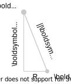
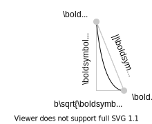
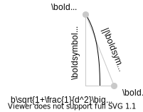

# Quadric Surfaces
A *quadric* surface is the three-dimensional extension of a conic section. Any quadric surface is uniquely defined by a real, symmetric 4x4 matrix:
```math
\boldsymbol{Q} = \{\boldsymbol{Q}\in\mathbb{R}^{4\times 4} \ | \ \boldsymbol{Q}^\mathsf{T}\boldsymbol{Q} = \boldsymbol{1}\}.
```
Before we deal with the internal structure of ``\boldsymbol{Q}``, let's first look at a more explicit definition of some quadric surfaces.

### Note on Canonical Form
In the following, we will examine different means of representing quadric surfaces. We will arbitrarily define a *canonical* form of the quadric surface which assumes the axis of the surface is the ``z``-axis. E.g. we consider canonical cylinders extending along the ``z``-axis, and canonical hyperboloids with the ``z``-axis as their axis of symmetry. This is in contrast to more general forms, in which a quadric's axis of symmetry may be *any* direction in the unit sphere.

## Planes
Any plane in three-dimensional space can be uniquely defined by a unit normal vector ``\boldsymbol{a}`` and a point located in the plane ``\boldsymbol{c}``. Then, a plane can be defined by the implicit function ``f_s(\boldsymbol{r})``:
```math
\begin{equation}
f_s(\boldsymbol{r}) = \boldsymbol{a}^\mathsf{T}\boldsymbol{r} - \boldsymbol{a}^\mathsf{T}\boldsymbol{c} = 0.
\end{equation}
```
We can rearrange for better interpretation:
```math
\begin{aligned}
0 &= \boldsymbol{a}^\mathsf{T}\boldsymbol{r} - \boldsymbol{a}^\mathsf{T}\boldsymbol{c} \\
&= \boldsymbol{a}^\mathsf{T}(\boldsymbol{r} - \boldsymbol{c})
\end{aligned}
```
which essentially says the vector from any point in the plane ``\boldsymbol{r}`` to another known point in the plane ``\boldsymbol{c}`` must be perpendicular (zero inner product) to the plane normal ``\boldsymbol{a}``.

## Cylinders
A cylinder with radius ``R`` in canonical form is defined:
```math
x^2 + y^2 = R^2.
```
We can use intuition from this canonical form to define a more general vector form of the cylinder equation. Consider the general cylinder with arbitrary unit axis ``\boldsymbol{a}`` which passes through a point ``\boldsymbol{c}`` (note that ``\boldsymbol{c}`` is not unique):


We wish to determine the locus of points ``\boldsymbol{r}`` which lie on this cylinder. Assume we pick an ``\boldsymbol{r}`` which *does* lie on the cylinder. Then, we can draw the following triangle with ``\boldsymbol{r}`` and ``\boldsymbol{c}`` defining the hypotenuse:



Here, the hypotenuse length is simply the distance between ``\boldsymbol{r}`` and ``\boldsymbol{c}``, and the vertical leg is the projection of ``\boldsymbol{r} - \boldsymbol{c}`` onto ``\boldsymbol{a}``. The horizontal leg is constant for any ``\boldsymbol{r}``. Applying the Pythagorean theorem gives us the following definition for a cylinder:
```math
\begin{equation}
f_c(\boldsymbol{r}) = R^2 + \big(\boldsymbol{a}^\mathsf{T}(\boldsymbol{r} - \boldsymbol{c})\big)^2 - ||\boldsymbol{r} - \boldsymbol{c}||^2 = 0.
\end{equation}
```

## Paraboloids
A circular paraboloid in canonical form is defined
```math
x^2 + y^2 = bz^2
```
or, in other words, the circular cross section of the paraboloid grows at a rate ``\sqrt{b}`` as ``z`` increases.

To capture the same behavior for a paraboloid with arbitrary axis, consider the following paraboloid:


Again, we are trying to determine the locus of points which lie on this paraboloid. For any point ``\boldsymbol{r}`` on the paraboloid's surface, we can draw a triangle:



Here, the hypotenuse length is simply the distance between ``\boldsymbol{r}`` and ``\boldsymbol{c}``, and the vertical leg is the projection of ``\boldsymbol{r} - \boldsymbol{c}`` onto ``\boldsymbol{a}``. The horizontal leg length is equal to the square root of the left-hand side of the canonical form. Additionally, ``z`` in the canonical form is equivalent to ``\boldsymbol{a}^\mathsf{T}(\boldsymbol{r} - \boldsymbol{c})`` in the general form, and we rearrange for an explicit expression for the horizontal leg. After applying the Pythagorean theorem we have:
```math
\begin{equation}
f_p(\boldsymbol{r}) = \big(\boldsymbol{a}^\mathsf{T}(\boldsymbol{r} - \boldsymbol{c})\big)^2 + b^2\boldsymbol{a}^\mathsf{T}(\boldsymbol{r} - \boldsymbol{c}) - ||\boldsymbol{r} - \boldsymbol{c}||^2 = 0.
\end{equation}
```

## Hyperboloids
A circular hyperboloid of one sheet in canonical form is defined by
```math
x^2 + y^2 = R^2(1 + \frac{z^2}{b^2})
```
where ``R`` is the radius at the neck of the hyperboloid, and ``b`` defines its growth rate out.

To model a hyperboloid with arbitrary axis, consider the following hyperboloid:


Again, we are trying to determine the locus of points which lie on this paraboloid. For any point ``\boldsymbol{r}`` on the paraboloid's surface, we can draw a triangle:



As before, the hypotenuse length is simply the distance between ``\boldsymbol{r}`` and ``\boldsymbol{c}``, and the vertical leg is the projection of ``\boldsymbol{r} - \boldsymbol{c}`` onto ``\boldsymbol{a}``. Also like the case for the [Paraboloids](@ref), the horizontal leg's length is equal to the square root of the left-hand side of the canonical form, with ``z`` replaced by ``\boldsymbol{a}^\mathsf{T}(\boldsymbol{r} - \boldsymbol{c})`` in the general case. Then we use the Pythagorean theorem to develop the equation of a general hyperboloid:
```math
\begin{equation}
f_h(\boldsymbol{r}) = \big(\boldsymbol{a}^\mathsf{T}(\boldsymbol{r} - \boldsymbol{c})\big)^2 + R^2\Big(1 + \frac{1}{b^2}\big(\boldsymbol{a}^\mathsf{T}(\boldsymbol{r} - \boldsymbol{c})\big)^2\Big)  - ||\boldsymbol{r} - \boldsymbol{c}||^2 = 0.
\end{equation}
```

## Matrix Representation of Quadrics
There is a convenient alternative representation of quadric surfaces to the ``f_s``, ``f_c``, ``f_p``, and ``f_h`` defined above. By using *homogeneous coordinates* we can define equivalent surfaces that are expressed as matrix quadratic forms rather than implicit vector equations. Quadratic forms are inner products (such as the dot product) which encode some scaling, shifting, and rotation in a linear transformation. As such, they are conveniently defined by simple matrix multiplication.

### Homogeneous Coordinates
Homogeneous coordinates are one projection of vectors in ``\mathbb{R}^n`` to ``\mathbb{R}^{n+1}``. In our case, we will project from ``\mathbb{R}^3`` to ``\mathbb{R}^4``. The definition of the projection will specify the space to which we are projecting. Because we have chosen to project into a homogeneous coordinate space, we simply append each vector ``\boldsymbol{u} \in \mathbb{R}^3`` with ``1``, yielding the projected vector ``\boldsymbol{u}_h = \begin{bmatrix} \boldsymbol{u} \\ 1 \end{bmatrix} \in \mathbb{R}^4``. Since we are working towards expressing various quadric surfaces using matrix multiplication, the introduction of constant ``1`` term in projection ``\boldsymbol{u}_h`` will allow us to work introduce constant terms in the quadric matrix.

### General Quadric Matrices
We can use the concept of a homogeneous coordinate to express the general form of a quadric surface in three dimensions:
```math
f(\boldsymbol{r}_h) = \boldsymbol{r}_h^\mathsf{T}\boldsymbol{Q}\boldsymbol{r}_h = 0
```
where ``\boldsymbol{r}_h \in \mathbb{R}^4`` is the homogeneous coordinate corresponding to a point ``\boldsymbol{r} \in \mathbb{R}^3`` on the quadric surface, and ``\boldsymbol{Q} \in \mathbb{R}^{4\times 4}``. Now, assume that ``\boldsymbol{Q}`` can be represented by the symmetric block matrix:
```math
\boldsymbol{Q} = \begin{bmatrix} \boldsymbol{Q}_r & \boldsymbol{q}_d \\ \boldsymbol{q}_d^\mathsf{T} & q_0 \end{bmatrix}.
```
Expanding the definition of ``f(\boldsymbol{r}_h)`` above using this block structure yields:
```math
\begin{equation}
\begin{aligned}
f(\boldsymbol{r}_h) &= \boldsymbol{r}_h^\mathsf{T}\boldsymbol{Q}\boldsymbol{r}_h = 0\\
&= \begin{bmatrix} \boldsymbol{r}^\mathsf{T} & 1 \end{bmatrix} \begin{bmatrix} \boldsymbol{Q}_r & \boldsymbol{q}_d \\ \boldsymbol{q}_d^\mathsf{T} & q_0 \end{bmatrix} \begin{bmatrix} \boldsymbol{r} \\ 1 \end{bmatrix} \\
&= \boldsymbol{r}^\mathsf{T}\boldsymbol{Q}_r\boldsymbol{r} + \boldsymbol{q}_d^\mathsf{T}\boldsymbol{r} + \boldsymbol{r}^\mathsf{T}\boldsymbol{q}_d + q_0 \\
&= \boldsymbol{r}^\mathsf{T}\boldsymbol{Q}_r\boldsymbol{r} + 2\boldsymbol{q}_d^\mathsf{T}\boldsymbol{r} + q_0 \\
\end{aligned}
\end{equation}
```
Hopefully it is now clear why projecting ``\boldsymbol{r}`` to a homogeneous coordinate system is necessary: it allows the constant term ``q_0`` to remain constant when expanding the quadratic form. Now, we can define the contents of each block for specific quadric surfaces.

### Planes as Quadrics
Planes are not true quadric surfaces; they are degenerate. In other words, the information needed to define a plane can be encoded in a symmetric matrix smaller ``\mathbb{R}^{4\times 4}``. However, it is still convenient to develop a quadric representation of a plane so we can work with a uniform matrix structure. Recall the general block decomposition of ``\boldsymbol{Q}`` from [General Quadric Matrices](@ref) in Equation 5. We can set this form equal to the definition of a plane from Equation 1 to identify the block elements ``\boldsymbol{Q}_r``, ``\boldsymbol{q}_d``, and ``q_0``.
```math
\begin{aligned}
f_s(\boldsymbol{r}) &= && &&\boldsymbol{a}^\mathsf{T}\boldsymbol{r} &&- \boldsymbol{a}^\mathsf{T}\boldsymbol{c} \\
&= &&\boldsymbol{r}^\mathsf{T}\boldsymbol{Q}_r\boldsymbol{r} &&+ 2\boldsymbol{q}_d^\mathsf{T}\boldsymbol{r} &&+ q_0
\end{aligned}
```
From this equality, it is clear that for a plane:
* ``\boldsymbol{Q}_r = \boldsymbol{0}``
* ``\boldsymbol{q}_d = \frac{1}{2}\boldsymbol{a}``
* ``q_0 = -\boldsymbol{a}^\mathsf{T}\boldsymbol{c}``
Then for any plane prescribed by a unit normal ``\boldsymbol{a}`` and a point in the plane ``\boldsymbol{c}``, we define the quadric matrix for a plane ``\boldsymbol{Q}_s``:
```math
\begin{equation}
\boldsymbol{Q}_s = \begin{bmatrix} \boldsymbol{0} & \frac{1}{2}\boldsymbol{a} \\ \frac{1}{2}\boldsymbol{a}^\mathsf{T} & -\boldsymbol{a}^\mathsf{T}\boldsymbol{c} \end{bmatrix}.
\end{equation}
```

### Cylinders as Quadrics
Like planes, a quadric matrix for cylinders can be derived from the cylinder's vector equation by rearranging Equation 2 into a form similar to  Equation 5. To do this, we take advantage of several facts: that inner products of vectors return scalars, which multiply associatively, and that the outer product of two vectors is a symmetric matrix (equal to its transpose).
```math
\begin{aligned}
f_c(\boldsymbol{r}) &= R^2 &&+ \big(\boldsymbol{a}^\mathsf{T}(\boldsymbol{r} - \boldsymbol{c})\big)^2 &&- ||\boldsymbol{r} - \boldsymbol{c}||^2 \\
&= R^2 &&+ \big((\boldsymbol{r}^\mathsf{T} - \boldsymbol{c}^\mathsf{T})\boldsymbol{a})\big)\big(\boldsymbol{a}^\mathsf{T}(\boldsymbol{r} - \boldsymbol{c})\big) &&- (\boldsymbol{r} - \boldsymbol{c})^\mathsf{T}(\boldsymbol{r} - \boldsymbol{c}) \\
&= R^2 &&+ \big(\boldsymbol{r}^\mathsf{T}\boldsymbol{a} - \boldsymbol{c}^\mathsf{T}\boldsymbol{a}\big)\big(\boldsymbol{a}^\mathsf{T}\boldsymbol{r} - \boldsymbol{a}^\mathsf{T}\boldsymbol{c}\big) &&- (\boldsymbol{r}^\mathsf{T} - \boldsymbol{c}^\mathsf{T})(\boldsymbol{r} - \boldsymbol{c}) \\
&= R^2 &&+ (\boldsymbol{r}^\mathsf{T}\boldsymbol{a})(\boldsymbol{a}^\mathsf{T}\boldsymbol{r}) - 2(\boldsymbol{c}^\mathsf{T}\boldsymbol{a})(\boldsymbol{a}^\mathsf{T}\boldsymbol{r}) + (\boldsymbol{c}^\mathsf{T}\boldsymbol{a})(\boldsymbol{a}^\mathsf{T}\boldsymbol{c}) &&- (\boldsymbol{r}^\mathsf{T}\boldsymbol{r} - 2\boldsymbol{c}^\mathsf{T}\boldsymbol{r} + \boldsymbol{c}^\mathsf{T}\boldsymbol{c}) \\
&= R^2 &&+ \boldsymbol{r}^\mathsf{T}(\boldsymbol{a}\boldsymbol{a}^\mathsf{T})\boldsymbol{r} - 2\boldsymbol{c}^\mathsf{T}(\boldsymbol{a}\boldsymbol{a}^\mathsf{T})\boldsymbol{r} + \boldsymbol{c}^\mathsf{T}(\boldsymbol{a}\boldsymbol{a}^\mathsf{T})\boldsymbol{c} &&- (\boldsymbol{r}^\mathsf{T}\boldsymbol{1}\boldsymbol{r} - 2\boldsymbol{c}^\mathsf{T}\boldsymbol{1}\boldsymbol{r} + \boldsymbol{c}^\mathsf{T}\boldsymbol{1}\boldsymbol{c}) \\
&= &&\underbrace{\boldsymbol{r}^\mathsf{T}(\boldsymbol{a}\boldsymbol{a}^\mathsf{T} - \boldsymbol{1})\boldsymbol{r}}_{\text{quadratic term}} - \underbrace{2\boldsymbol{c}^\mathsf{T}(\boldsymbol{a}\boldsymbol{a}^\mathsf{T} - \boldsymbol{1})\boldsymbol{r}}_{\text{linear term}} + \underbrace{\boldsymbol{c}^\mathsf{T}(\boldsymbol{a}\boldsymbol{a}^\mathsf{T} - \boldsymbol{1})\boldsymbol{c} + R^2}_{\text{constant}} &&
\end{aligned}
```
We now have grouped the terms of Equation 2 into a quadratic term in ``\boldsymbol{r}``, a linear term in ``\boldsymbol{r}``, and a constant term. This is the same form as Equation 5, and we can compare easily:
```math
\begin{aligned}
f_c(\boldsymbol{r}) &= &&\boldsymbol{r}^\mathsf{T}(\boldsymbol{a}\boldsymbol{a}^\mathsf{T} - \boldsymbol{1})\boldsymbol{r} &&- 2\boldsymbol{c}^\mathsf{T}(\boldsymbol{a}\boldsymbol{a}^\mathsf{T} - \boldsymbol{1})\boldsymbol{r} &&+ \boldsymbol{c}^\mathsf{T}(\boldsymbol{a}\boldsymbol{a}^\mathsf{T} - \boldsymbol{1})\boldsymbol{c} + R^2 \\
&= &&\boldsymbol{r}^\mathsf{T}\boldsymbol{Q}_r\boldsymbol{r} &&+ 2\boldsymbol{q}_d^\mathsf{T}\boldsymbol{r} &&+ q_0 
\end{aligned}
```
So for a cylinder, we have:
* ``\boldsymbol{Q}_r = \boldsymbol{a}\boldsymbol{a}^\mathsf{T} - \boldsymbol{1}``
* ``\boldsymbol{q}_d = -(\boldsymbol{a}\boldsymbol{a}^\mathsf{T} - \boldsymbol{1})\boldsymbol{c}``
* ``q_0 = \boldsymbol{c}^\mathsf{T}(\boldsymbol{a}\boldsymbol{a}^\mathsf{T} - \boldsymbol{1})\boldsymbol{c} + R^2``
Then for any cylinder with radius ``R``, unit axis ``\boldsymbol{a}``, and a point on the axis ``\boldsymbol{c}`` we define the quadric matrix for a cylinder ``\boldsymbol{Q}_c``:
```math
\begin{equation}
\boldsymbol{Q}_c = \begin{bmatrix} \boldsymbol{a}\boldsymbol{a}^\mathsf{T} - \boldsymbol{1} & -(\boldsymbol{a}\boldsymbol{a}^\mathsf{T} - \boldsymbol{1})\boldsymbol{c} \\ -\boldsymbol{c}^\mathsf{T}(\boldsymbol{a}\boldsymbol{a}^\mathsf{T} - \boldsymbol{1}) & \boldsymbol{c}^\mathsf{T}(\boldsymbol{a}\boldsymbol{a}^\mathsf{T} - \boldsymbol{1})\boldsymbol{c} + R^2 \end{bmatrix}.
\end{equation}
```

### Paraboloids as Quadrics
Like cylinders, a quadric matrix for paraboloids can be derived from the paraboloid's vector equation by rearranging Equation 3 into a form similar to  Equation 5. We take a similar approach to the analysis of cylinders:
```math
\begin{aligned}
f_p(\boldsymbol{r}) &= &&\big(\boldsymbol{a}^\mathsf{T}(\boldsymbol{r} - \boldsymbol{c})\big)^2 + b^2\boldsymbol{a}^\mathsf{T}(\boldsymbol{r} - \boldsymbol{c}) &&- ||\boldsymbol{r} - \boldsymbol{c}||^2 \\
&= &&\big((\boldsymbol{r}^\mathsf{T} - \boldsymbol{c}^\mathsf{T})\boldsymbol{a}\big)\big(\boldsymbol{a}^\mathsf{T}(\boldsymbol{r} - \boldsymbol{c})\big) + b^2\boldsymbol{a}^\mathsf{T}(\boldsymbol{r} - \boldsymbol{c}) &&- (\boldsymbol{r} - \boldsymbol{c})^\mathsf{T}(\boldsymbol{r} - \boldsymbol{c}) \\
&= &&\big(\boldsymbol{r}^\mathsf{T}\boldsymbol{a} - \boldsymbol{c}^\mathsf{T}\boldsymbol{a}\big)\big(\boldsymbol{a}^\mathsf{T}\boldsymbol{r} - \boldsymbol{a}^\mathsf{T}\boldsymbol{c}\big) + b^2(\boldsymbol{a}^\mathsf{T}\boldsymbol{r} - \boldsymbol{a}^\mathsf{T}\boldsymbol{c}) &&- (\boldsymbol{r}^\mathsf{T} - \boldsymbol{c}^\mathsf{T})(\boldsymbol{r} - \boldsymbol{c}) \\
&= &&(\boldsymbol{r}^\mathsf{T}\boldsymbol{a})(\boldsymbol{a}^\mathsf{T}\boldsymbol{r}) - 2(\boldsymbol{c}^\mathsf{T}\boldsymbol{a})(\boldsymbol{a}^\mathsf{T}\boldsymbol{r}) + (\boldsymbol{c}^\mathsf{T}\boldsymbol{a})(\boldsymbol{a}^\mathsf{T}\boldsymbol{c}) + b^2\boldsymbol{a}^\mathsf{T}\boldsymbol{r} - b^2\boldsymbol{a}^\mathsf{T}\boldsymbol{c} &&- (\boldsymbol{r}^\mathsf{T}\boldsymbol{r} - 2\boldsymbol{c}^\mathsf{T}\boldsymbol{r} + \boldsymbol{c}^\mathsf{T}\boldsymbol{c}) \\
&= &&\boldsymbol{r}^\mathsf{T}(\boldsymbol{a}\boldsymbol{a}^\mathsf{T})\boldsymbol{r} - 2\boldsymbol{c}^\mathsf{T}(\boldsymbol{a}\boldsymbol{a}^\mathsf{T})\boldsymbol{r} + b^2\boldsymbol{a}^\mathsf{T}\boldsymbol{r} + \boldsymbol{c}^\mathsf{T}(\boldsymbol{a}\boldsymbol{a}^\mathsf{T})\boldsymbol{c} - b^2\boldsymbol{a}^\mathsf{T}\boldsymbol{c} &&- (\boldsymbol{r}^\mathsf{T}\boldsymbol{1}\boldsymbol{r} - 2\boldsymbol{c}^\mathsf{T}\boldsymbol{1}\boldsymbol{r} + \boldsymbol{c}^\mathsf{T}\boldsymbol{1}\boldsymbol{c}) \\
&= &&\underbrace{\boldsymbol{r}^\mathsf{T}(\boldsymbol{a}\boldsymbol{a}^\mathsf{T} - \boldsymbol{1})\boldsymbol{r}}_{\text{quadratic term}} + \underbrace{b^2\boldsymbol{a}^\mathsf{T}\boldsymbol{r} - \boldsymbol{c}^\mathsf{T}(\boldsymbol{a}\boldsymbol{a}^\mathsf{T} - \boldsymbol{1})\boldsymbol{r}}_{\text{linear term}} + \underbrace{b^2\boldsymbol{a}^\mathsf{T}\boldsymbol{c} + \boldsymbol{c}^\mathsf{T}(\boldsymbol{a}\boldsymbol{a}^\mathsf{T} - \boldsymbol{1})\boldsymbol{c}}_{\text{constant}}
\end{aligned}
```
Now we can compare to Equation 5:
```math
\begin{aligned}
f_p(\boldsymbol{r}) &= &&\boldsymbol{r}^\mathsf{T}(\boldsymbol{a}\boldsymbol{a}^\mathsf{T} - \boldsymbol{1})\boldsymbol{r} &&+ b^2\boldsymbol{a}^\mathsf{T}\boldsymbol{r} - 2\boldsymbol{c}^\mathsf{T}(\boldsymbol{a}\boldsymbol{a}^\mathsf{T} - \boldsymbol{1})\boldsymbol{r} &&+ b^2\boldsymbol{a}^\mathsf{T}\boldsymbol{c} + \boldsymbol{c}^\mathsf{T}(\boldsymbol{a}\boldsymbol{a}^\mathsf{T} - \boldsymbol{1})\boldsymbol{c} \\
&= &&\boldsymbol{r}^\mathsf{T}\boldsymbol{Q}_r\boldsymbol{r} &&+ 2\boldsymbol{q}_d^\mathsf{T}\boldsymbol{r} &&+ q_0 
\end{aligned}
```
So the block matrix elements for a paraboloid are:
* ``\boldsymbol{Q}_r = \boldsymbol{a}\boldsymbol{a}^\mathsf{T} - \boldsymbol{1}``
* ``\boldsymbol{q}_d = \frac{b^2}{2}\boldsymbol{a} - (\boldsymbol{a}\boldsymbol{a}^\mathsf{T} - \boldsymbol{1})\boldsymbol{c}``
* ``q_0 = b^2\boldsymbol{a}^\mathsf{T}\boldsymbol{c} + \boldsymbol{c}^\mathsf{T}(\boldsymbol{a}\boldsymbol{a}^\mathsf{T} - \boldsymbol{1})\boldsymbol{c}``
Then for any paraboloid with growth parameter ``b``, unit axis ``\boldsymbol{a}``, and a vertex ``\boldsymbol{c}`` we define the quadric matrix for a paraboloid ``\boldsymbol{Q}_p``:
```math
\begin{equation}
\boldsymbol{Q}_p = \begin{bmatrix} \boldsymbol{a}\boldsymbol{a}^\mathsf{T} - \boldsymbol{1} & \frac{b^2}{2}\boldsymbol{a} - (\boldsymbol{a}\boldsymbol{a}^\mathsf{T} - \boldsymbol{1})\boldsymbol{c} \\ \frac{b^2}{2}\boldsymbol{a}^\mathsf{T} - \boldsymbol{c}^\mathsf{T}(\boldsymbol{a}\boldsymbol{a}^\mathsf{T} - \boldsymbol{1}) & b^2\boldsymbol{a}^\mathsf{T}\boldsymbol{c} + \boldsymbol{c}^\mathsf{T}(\boldsymbol{a}\boldsymbol{a}^\mathsf{T} - \boldsymbol{1})\boldsymbol{c} \end{bmatrix}.
\end{equation}
```

### Hyperboloids as Quadrics
Like paraboloids, a quadric matrix for hyperboloids can be derived from the hyperboloid's vector equation by rearranging Equation 4 into a form similar to  Equation 5. We take a similar approach to the analysis of cylinders:
```math
\begin{aligned}
f_h(\boldsymbol{r}) &= && R^2\Big(1 + \frac{1}{b^2}\big(\boldsymbol{a}^\mathsf{T}(\boldsymbol{r} - \boldsymbol{c})\big)^2\Big) + \big(\boldsymbol{a}^\mathsf{T}(\boldsymbol{r} - \boldsymbol{c})\big)^2 &&- ||\boldsymbol{r} - \boldsymbol{c}||^2 \\
&= && R^2 + \Big(1 + \frac{R^2}{b^2}\Big)\big(\boldsymbol{a}^\mathsf{T}(\boldsymbol{r} - \boldsymbol{c})\big)^2 &&- (\boldsymbol{r} - \boldsymbol{c})^\mathsf{T}(\boldsymbol{r} - \boldsymbol{c}) \\
&= && R^2 + \Big(1 + \frac{R^2}{b^2}\Big)\big(\boldsymbol{r}^\mathsf{T}\boldsymbol{a} - \boldsymbol{c}^\mathsf{T}\boldsymbol{a}\big)\big(\boldsymbol{a}^\mathsf{T}\boldsymbol{r} - \boldsymbol{a}^\mathsf{T}\boldsymbol{c}\big) &&- (\boldsymbol{r}^\mathsf{T} - \boldsymbol{c}^\mathsf{T})(\boldsymbol{r} - \boldsymbol{c}) \\
&= && R^2 + \Big(1 + \frac{R^2}{b^2}\Big) \Big((\boldsymbol{r}^\mathsf{T}\boldsymbol{a})(\boldsymbol{a}^\mathsf{T}\boldsymbol{r}) - 2(\boldsymbol{c}^\mathsf{T}\boldsymbol{a})(\boldsymbol{a}^\mathsf{T}\boldsymbol{r}) + (\boldsymbol{c}^\mathsf{T}\boldsymbol{a})(\boldsymbol{a}^\mathsf{T}\boldsymbol{c})\Big) &&- (\boldsymbol{r}^\mathsf{T}\boldsymbol{r} - 2\boldsymbol{c}^\mathsf{T}\boldsymbol{r} + \boldsymbol{c}^\mathsf{T}\boldsymbol{c}) \\
&= && R^2 + \Big(1 + \frac{R^2}{b^2}\Big) \Big((\boldsymbol{r}^\mathsf{T}(\boldsymbol{a}\boldsymbol{a}^\mathsf{T})\boldsymbol{r} - 2\boldsymbol{c}^\mathsf{T}(\boldsymbol{a}\boldsymbol{a}^\mathsf{T})\boldsymbol{r} + \boldsymbol{c}^\mathsf{T}(\boldsymbol{a}\boldsymbol{a}^\mathsf{T})\boldsymbol{c}\Big) &&- (\boldsymbol{r}^\mathsf{T}\boldsymbol{1}\boldsymbol{r} - 2\boldsymbol{c}^\mathsf{T}\boldsymbol{1}\boldsymbol{r} + \boldsymbol{c}^\mathsf{T}\boldsymbol{1}\boldsymbol{c}) \\
&= &&\underbrace{\boldsymbol{r}^\mathsf{T}\bigg(\Big(1 + \frac{R^2}{b^2}\Big)\boldsymbol{a}\boldsymbol{a}^\mathsf{T} - \boldsymbol{1}\bigg)\boldsymbol{r}}_{\text{quadratic term}} - \underbrace{2\boldsymbol{c}^\mathsf{T}\bigg(\Big(1 + \frac{R^2}{b^2}\Big)\boldsymbol{a}\boldsymbol{a}^\mathsf{T} - \boldsymbol{1}\bigg)\boldsymbol{r}}_{\text{linear term}} &&+ \underbrace{R^2 + \boldsymbol{c}^\mathsf{T}\bigg(\Big(1 + \frac{R^2}{b^2}\Big)\boldsymbol{a}\boldsymbol{a}^\mathsf{T} - \boldsymbol{1}\bigg)\boldsymbol{c}}_{\text{constant}}
\end{aligned}
```
So the block matrix elements for a hyperboloid are:
* ``\boldsymbol{Q}_r = \Big(1 + \frac{R^2}{b^2}\Big)\boldsymbol{a}\boldsymbol{a}^\mathsf{T} - \boldsymbol{1}``
* ``\boldsymbol{q}_d = -\bigg(\Big(1 + \frac{R^2}{b^2}\Big)\boldsymbol{a}\boldsymbol{a}^\mathsf{T} - \boldsymbol{1}\bigg)\boldsymbol{c}``
* ``q_0 = R^2 + \boldsymbol{c}^\mathsf{T}\bigg(\Big(1 + \frac{R^2}{b^2}\Big)\boldsymbol{a}\boldsymbol{a}^\mathsf{T} - \boldsymbol{1}\bigg)\boldsymbol{c}``
Then for any hyperboloid with neck radius ``R``, growth parameter ``b``, unit axis ``\boldsymbol{a}``, and a vertex ``\boldsymbol{c}`` we define the quadric matrix for a hyperboloid ``\boldsymbol{Q}_h``:
```math
\begin{equation}
\boldsymbol{Q}_h = \begin{bmatrix} \Big(1 + \frac{R^2}{b^2}\Big)\boldsymbol{a}\boldsymbol{a}^\mathsf{T} - \boldsymbol{1} & -\bigg(\Big(1 + \frac{R^2}{b^2}\Big)\boldsymbol{a}\boldsymbol{a}^\mathsf{T} - \boldsymbol{1}\bigg)\boldsymbol{c} \\ -\boldsymbol{c}^\mathsf{T}\bigg(\Big(1 + \frac{R^2}{b^2}\Big)\boldsymbol{a}\boldsymbol{a}^\mathsf{T} - \boldsymbol{1}\bigg) & R^2 + \boldsymbol{c}^\mathsf{T}\bigg(\Big(1 + \frac{R^2}{b^2}\Big)\boldsymbol{a}\boldsymbol{a}^\mathsf{T} - \boldsymbol{1}\bigg)\boldsymbol{c} \end{bmatrix}.
\end{equation}
```

## Classifying Quadric Matrices
Now that we have quadric matrices for some common quadric surfaces, we have another problem to deal with: how to tell what kind of shape a given quadric surface represents.

## Converting Quadric Matrix to Surface Parameters